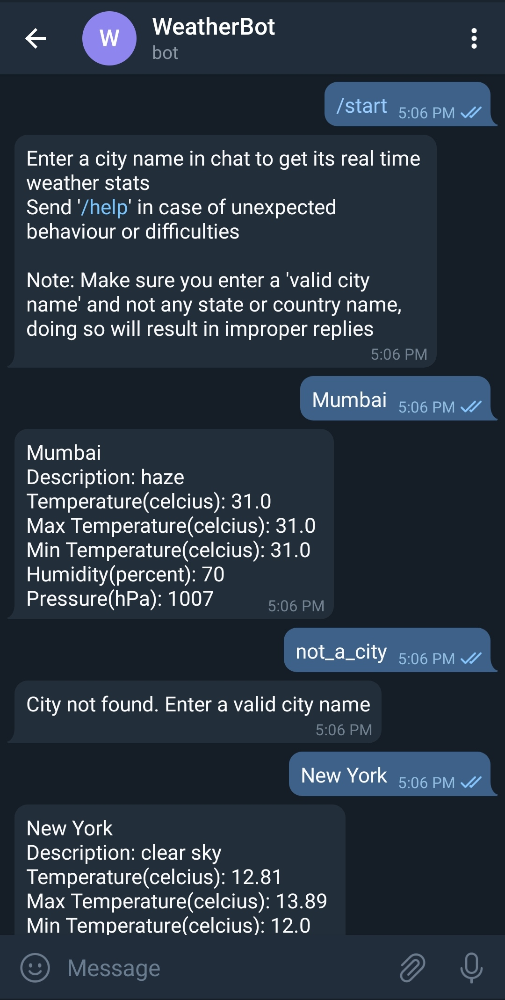

# Telegram Weather Bot

Telegram bot that provides real time weather info of a particular city using Open Weahter Maps API
<p align="center">
  
</p>

## How to run

* Clone the repository: <br>
``` $ https://github.com/pockemon/Youtube-Video-Downloader ``` 

### Requirements
- `pip` install the packages in requirements.txt
- Stable internet connnection required

### Creating the Bot
- Got to telegram
- Search for 'BotFather' and click on the blue ticked account
- Follow the instructions given to create a new bot
- Copy the key and replace the given key with `YOUR_KEY` in telegram_config.cfg

### Getting API Key
- Sign up on [Open Weather](https://openweathermap.org/) for free
- Click on your username and go to 'My API Keys' section
- Copy the API key and replace the given key with `YOUR_KEY` in owm_config.cfg

### Executing the Program
* cd into directory using your command prompt: <br>
```$ cd Youtube-Video-Downloader ```
* Run the server.py file: <br>
```$ python server.py ```

## Author

[Naman Shah](https://github.com/namanshah01)
